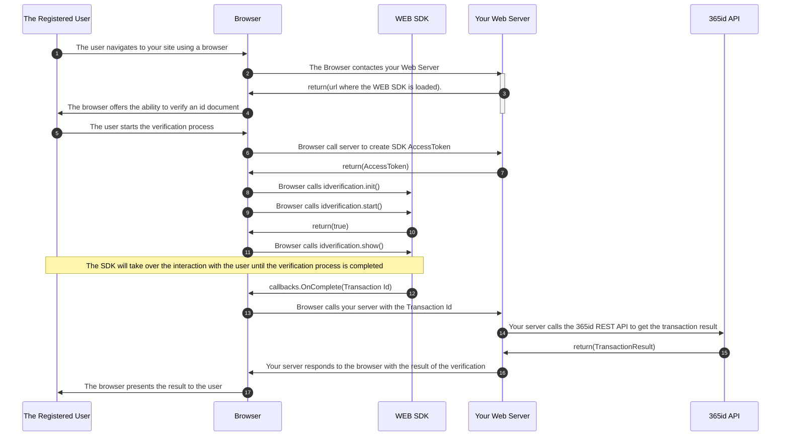

# 365id Id Verification WEB SDK

The 365id Id Verification SDK enables you to integrate 365id services into your WEB application. We also support [Android](https://github.com/365id-AB/idverification-android) and [iOS](https://github.com/365id-AB/idverification-ios).

The SDK supports identifying and validating ID documents such as passports, ID cards and drivers' licenses, as well as reading the text on the document and automatically mapping these to relevant fields when used in conjunction with the [365id Integration Service](https://365id.com/integrations/?lang=en).

<br/>

## Registration

If you are already a customer of 365id then you can request sdk credentials by contacting 365id's support at [support@365id.com](mailto:support@365id.com).

Otherwise you can contact us at [info@365id.com](mailto:info@365id.com) for further information.

<br/>

## Requirements

In order to get started with development a regular pc should be sufficient, we have an example using docker and python that will get you started easily. But docker or python is not at all a requirement.

- A browser capable of running javascript modules. Chrome, Firefox and Safari all work.
- A web camera connected to the pc.

<br/>

## Project setup

Our WEB SDK is distributed using npmjs.org and is available on request at the moment.

[@365id/id-verification](https://www.npmjs.com/package/@365id/id-verification)

### Sample Application

Please note that there is a [Example Application](/Example/README.md) written in JavaScript and Python that demonstrates how the SDK can be used, available in this repository.

<br/>

## Get started

In order to use the 365id Id Verification SDK it is necessary to follow the steps below.

### Retrieve an access token

Before being able to use the 365id Id Verification SDK, you will need an access token and to get that you will need to make a Rest API call with your client id and secret. If you don't have the credentials (clientid and client secret), please contact us at [info@365id.com](mailto:info@365id.com). Once you have received the credentials you will be able to request an access token. If the access token has expired you don't have to request a new one, all you have to do is refresh it using the refresh_token endpoint.

**Url**: https://global-customer-frontend.365id.com

### Retrieve a session token and transaction id using the access token

The session token is what the SDK uses to tell the servers it's a valid connection attempt.

#### **/api/v1/access_token**

_Used for retrieving a new access token using the client id and secret, also known as customer external id and license key_

POST
Request

_Body - application/json_

```json
{
  "client_id": "string",
  "client_secret": "string"
  "allowed_origin": "string",
  "transfer_device_domain_url": "string" // optional if want to continue on other device
}
```

Response
| Code | Description |
| ---- | ----------- |
| 200 | Success |

_Body - application/json_

```json
{
  "access_token": "string",
  "token_type": "string",
  "expires_in": 0,
  "refresh_token": "string",
  "scope": "string"
}
```

| Code | Description |
| ---- | ----------- |
| 400  | Bad Request |

_Body - application/json_

```json
{
  "error": "string",
  "error_description": "string"
}
```

---

#### **/api/v1/refresh_token**

_Used for refreshing an already retrieved access token. Can be called even if your access token is expired_

POST
Request

_Header_
| Key | Value |
| ----| ----- |
| Authorization | Bearer \<access_token\> |

_Body - application/json_

```json
{
  "refresh_token": "string"
}
```

Response
| Code | Description |
| ---- | ----------- |
| 200 | Success |

_Body - application/json_

```json
{
  "access_token": "string",
  "token_type": "string",
  "expires_in": 0,
  "refresh_token": "string",
  "scope": "string"
}
```

| Code | Description |
| ---- | ----------- |
| 400  | Bad Request |

_Body - application/json_

```json
{
  "error": "string",
  "error_description": "string"
}
```

---

The _access token_ is valid for a short amount of time, after that you will have to refresh the _access token_ using the provided refresh token.

If you decide to use the option __transfer_device_domain_url__ you will need to contact 365id to register this domain name if it differs from the __allowed_origin__.

> **⚠️ SECURITY NOTICE:** In a production solution, it is strongly recommended that you obtain the _access token_ using a server-to-server call. The example shows how this can be done using a python application.

<br/>

### Call the SDK

#### Simple example

```js
// create the idverification sdk object.
const idVerification = new IdVerification365Id()

// Initialize the SDK with some basic information.
idVerification.init(
   "div_you_want_the_sdk_to_operate_on",
   window.location.origin + "/public_file_path",
)

// Start an id verification transaction.
var started = await idVerification.start(
   {
      accessToken: "the token that you get through the web server",
      callbacks: {
         {
            onComplete: (transactionId) => {
               // called when the identification process has completed
            },
            onUserDismissed: (transactionId) => {
               // Called when the process is aborted by the user pressing a cancel button.
               verification.stop() // The SDK should be stopped after the user has dissmissed the verification session.
            },
            onError: (exception) => {
               // This is called when a error happens in the id verification process.
               verification.stop() // The SDK should be stopped after an error has been reported.
            },
         }
      }
   }
)

if (started) {
   // The id verificaton SDK started successfully.

   // We tell the SDK to show its first view and take control of the supplied element identified by the provided element id.
   idVerification.show()
} else {
   console.error("Unable to start the id verification SDK")
}
```
---
#### Extensive Example

It is possible to set a lot of more options if that is needed. In the example below we do the following:

We specify the language that should be used by the SDK in the `.init()`call.
Then we add a theming option using the `.withTheme()`call.

Finally when we call the `.start()`method.
We tell the SDK to not show the _Selection View_ by specifying a __handOffConfig__.
We specify what kind of document should be expected, __documentSizeType__ = 1 => id1 cards (credit card size).
and finally we configure this transaction to skip the face matching module, by setting __modulesToSkip__.
```js
// Create the id verification sdk object.
const idVerification = new IdVerification365Id()

// Initialize the SDK.
idVerification.init(
   "div_you_want_the_sdk_to_operate_on",
   window.location.origin + "/public_file_path",
   {
      language: "en",
      countryCode: "gb"
   }
)

// Use the `withTheme` method to replace the logo used in the SDK.
idVerification.withTheme(logo: window.location.origin + "/path/to/your/logo.svg") // Optional call.

// Start an id verification transaction with some specific options.
var started = await idVerification.start(
   {
      accessToken: "the token that you get through the web server",
      startOptions: {               // Options that can be used to customize how the SDK behaves
         handOffConfig: {           // A handOffConfig can be supplied to skip the selection view in the SDK, the handOffConfig is made to be extendible in the future
            mode: "current-device"  // Specific option to continue on the same device.
         },
         documentSizeType: 1,       // This configures the expected document type. This will alter the illustrations used in the SDK.
         modulesToSkip: [1]         // Gives you the option to skip specific modules in the verification process. Right now only the face match module is possible to skip.
      },
      callbacks: {                  // functions that you define that will be called on specific event.s
         {
            onStarted: () => {
               // This is called when the SDK has started successfully
            },
            onTransactionCreated: (transactionId) => {
               // Called when a transactionId is available.
            },
            onComplete: (transactionId) => {
               // called when the identification process has completed.

            },
            onUserDismissed: (transactionId) => {
               // Called when the process is aborted by the user, they pressed a cancel button.
               verification.stop() // The SDK should be stopped after the user has dissmissed the verification session.
            },
            onError: (exception) => {
               // This is called when a error happens in the id verification process.
               // A complete list of errors is available in the API documentation.
               verification.stop() // The SDK should be stopped after an error has been reported.
            },
            onDocumentFeedback: (documentType, countryCode) => {
               // This is called during the id verification process after the document image has been processed.
               // `documentType` tells what kind of document has been identified and `countryCode` tells you the issuing country.
            },
            onFaceMatchFeedbackWithSource:(faceMatchStatus, faceMatchSource) => {
               // This is called during the id verification process, after the face matching has been processed.
               // `faceMatchStatus` tells if the matching was successfull, `faceMatchSource` tells what source image was used to perform the matching.
            }
         }
      }
   }
)

// We check if the SDK was able to start a verification process
if (started) {
   // The verification process was possible to start.
   idVerification.show()   // We show the SDK views using the element id provided in the `.init()` call.
} else {
   console.error("Unable to start the id verification SDK")
}
```

<br/>

#### Document size type selection

You are able to select the document size that you want the registered person to use. This option will alter the ilustrations used throughout the id verification process.

<br/>

#### Modules To Skip

This option allows you to skip the face matching step on a per transaction basis.

<br/>

#### Using the Callbacks

The callbacks offer you a direct way of acting on things that happen in the id verification process.

If your user scans the wrong kind of document you are able to abort the verification process directly. This is done by using the `onDocumentFeedback` callback.

<br/>

### Launch the SDK View

The `show()` call is used to activate the verification process. This will cause the SDK to render in the supplied element identified by the id supplied in the `init()` call.
The SDK is designed to use the major part of the browser window, the supplied element

<br/>

### Validation of result

To validate the result you will have to use an already existing or a new integration with 365id API. The data returned back contains all the extracted fields along with the captured images and the assessment of the document. The captured data is handled in accordance with GDPR and our official [privacy policy](https://365id.com/privacy-policy/).
The data retention time is configurable in our [Customer Portal](https://365id.com/integrations/), though only within the limits of the GDPR.

Documentation for the 365id API integration is not covered in this README, it is only delivered on request, so please contact 365id Support at [support@365id.com](mailto:support@365id.com) for your copy.

> **:exclamation: NOTICE:** The example project does not show how to validate the result from the SDK.

<br/>

## Custom Theme

Before calling IdVerification365Id.start(), you can customize the SDK logo by using `IdVerification365Id.withTheme({logo: "path/to/custom/logo"})`.
The theming posibilities are planned to be extended.

<br/>

## Log

### What data are we collecting

We are not, during any stage, collecting the users PII (Personal Identifiable Information). That includes, but are not limited to; email addresses, user names, phone number etc.

<br/>

## Production implementation

To implement the SDK inside your app, we recommend an implementation that follows this diagram:



<br/>

## Retry attempts and how they impact the flow in the SDK

If the identification process goes well the SDK will follow a "standard" flow, where the different steps will appear in the following order:

### Document scan &rarr; Facematch

However if one of the steps fails, we will deviate from the standard flow.
For example, If we are unable to capture a clear image of the document the image cpturing step will be retried.

### Early feedback and retries

The early feedback will provide the integrator with an early indicator of the success or failure of a performed step in the SDK.
The feedback is provided through callbacks, one for each step of the identification process.

### Document feedback

Callback received after the document identification process.
This callback will provide information about the type of document that's been scanned and the country code of the issuing country.
```ts
onDocumentFeedback: (documentType: DocumentType, countryCode: string): void => {
   console.log("Document feedback received.");
   console.log("Document type: " + documentType + " Country code: " + countryCode);
},
```
If we are unable to identify the document, no feedback will be sent.

### Facematch feedback

Callback received after the facematch step.
This callback will provide information about the status of the facematch, either `Matched`, `NoMatch` or `Aborted`.
```ts
onFaceMatchFeedbackWithSource: (faceMatchStatus: FaceMatchStatus, faceMatchSource: FaceMatchSource): void => {
   console.log("Face match feedback with source received.");
   console.log("Face match feedback: " + faceMatchStatus + " Fcae match source: " + faceMatchSource);
},
```
If we are unable to match the face, feedback will be sent with `FacematchFeedback` set to `NoMatch`.

<br/>


<br/>
<br/>
<br/>

## Help & support

For additional help, please contact support@365id.com.
