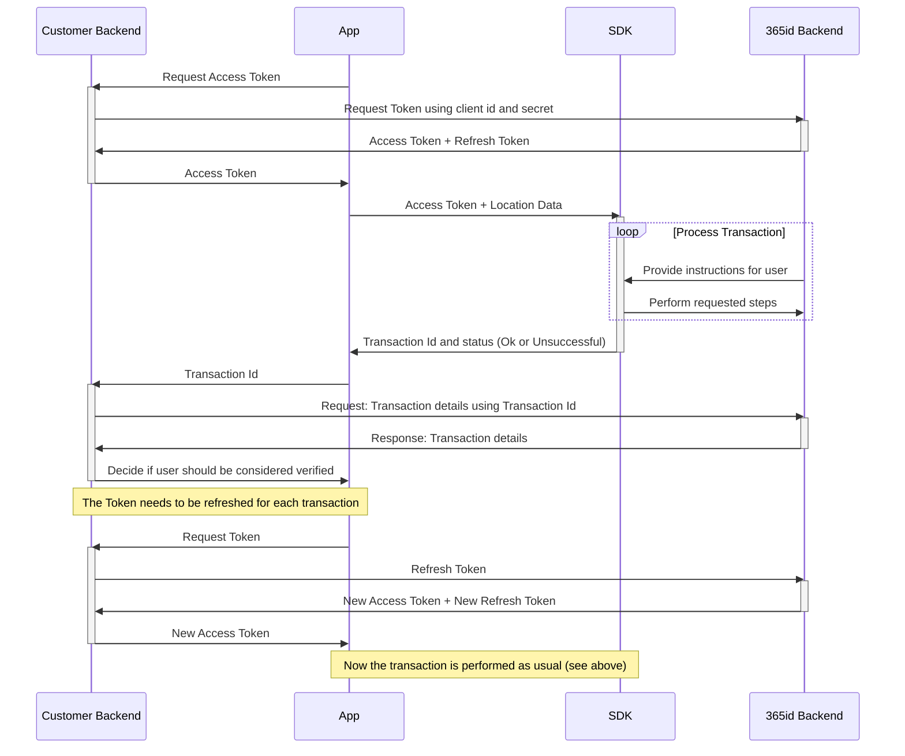
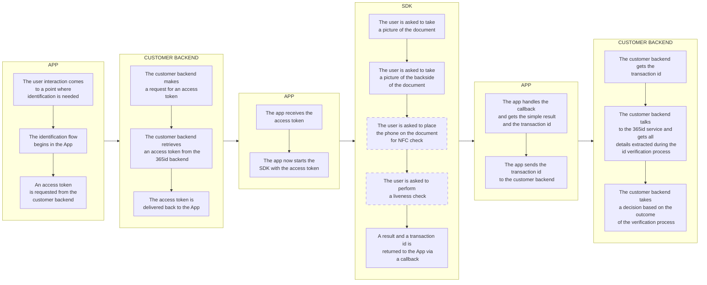

# 365id Id Verification WEB SDK

The 365id Id Verification SDK enables you to integrate 365id services into your WEB application. We also support [Android](https://github.com/365id-AB/idverification-android) and [iOS](https://github.com/365id-AB/idverification-ios)..

The SDK supports identifying and validating ID documents such as passports, ID cards and drivers' licenses, as well as reading the text on the document and automatically mapping these to relevant fields when used in conjunction with the [365id Integration Service](https://365id.com/integrations/?lang=en).

<br/>
<br/>
<br/>

## Registration

If you are already a customer of 365id then you can request sdk credentials by contacting 365id's support at [support@365id.com](mailto:support@365id.com).

Otherwise you can contact us at [info@365id.com](mailto:info@365id.com) for further information.

<br/>
<br/>
<br/>

## Requirements

- A modern browser
- A Camera

<br/>
<br/>
<br/>

## Project setup

<br/>
<br/>
<br/>

### Package distribution

<br/>
<br/>
<br/>

#### NPM Package

<br/>
<br/>
<br/>

### Sample Application

Please note that there is a [Example Application](/Example/README.md) written in JavaScript and Python that demonstrates how the SDK can be used, available in this repository.

<br/>
<br/>
<br/>

## Get started

In order to use the 365id Id Verification SDK it is necessary to follow the steps below.

### Retrieve a token

Before being able to use the 365id Id Verification SDK, you will need an access token and to get that you will need to make a Rest API call with your client id and secret. If you don't have the credentials, please contact us at [info@365id.com](mailto:info@365id.com). Once you have received the credentials you will be able to request an access token. If the access token has expired you don't have to request a new one, all you have to do is refresh it using the refresh_token endpoint.

**Url**: https://global-customer-frontend.365id.com

---

#### **/api/v1/access_token**

_Used for retrieving a new access token using the client id and secret, also known as customer external id and license key_

POST
Request

_Body - application/json_

```json
{
  "client_id": "string",
  "client_secret": "string"
  "allowed_origin": "string",
  "transfer_device_domain_url": "string" // optional if want to continue on other device
}
```

Response
| Code | Description |
| ---- | ----------- |
| 200 | Success |

_Body - application/json_

```json
{
  "access_token": "string",
  "token_type": "string",
  "expires_in": 0,
  "refresh_token": "string",
  "scope": "string"
}
```

| Code | Description |
| ---- | ----------- |
| 400  | Bad Request |

_Body - application/json_

```json
{
  "error": "string",
  "error_description": "string"
}
```

---

#### **/api/v1/refresh_token**

_Used for refreshing an already retrieved access token. The access token can be or almost be expired when making this call_

POST
Request

_Header_
| Key | Value |
| ----| ----- |
| Authorization | Bearer \<access_token\> |

_Body - application/json_

```json
{
  "refresh_token": "string"
}
```

Response
| Code | Description |
| ---- | ----------- |
| 200 | Success |

_Body - application/json_

```json
{
  "access_token": "string",
  "token_type": "string",
  "expires_in": 0,
  "refresh_token": "string",
  "scope": "string"
}
```

| Code | Description |
| ---- | ----------- |
| 400  | Bad Request |

_Body - application/json_

```json
{
  "error": "string",
  "error_description": "string"
}
```

---

The access token is valid for a certain amount of time, after that you will have to refresh the access token using the provided refresh token

> **⚠️ SECURITY NOTICE:** In a production app, it is recommended that you obtain the JWT token using a server-to-server call. The example app retrieves it directly for the sake of simplicity.

<br/>
<br/>

### Call the SDK

<br/>
<br/>
<br/>

#### Document size type selection

<br/>
<br/>
<br/>

#### Modules To Skip

<br/>
<br/>
<br/>

#### Using the Callbacks

<br/>
<br/>
<br/>

### Launch the SDK View

<br/>
<br/>
<br/>

### Validation of result

To validate the result you will have to use an existing or a new integration with 365id Services. The data returned back contains all the extracted fields along with the captured images and the assessment of the document. The
captured data is handled in accordance with GDPR and our official [privacy policy](https://365id.com/privacy-policy/).
The data retention time is configurable in our [Customer Portal](https://365id.com/integrations/), though only within the limits of the GDPR.

Documentation for that integration is not covered in this README, it is only delivered on request, so please contact 365id Support at [support@365id.com](mailto:support@365id.com) for your copy.

> **:exclamation: NOTICE:** The example project does not show how to validate the result from the SDK.

<br/>
<br/>

## Custom Theme

Before calling IdVerification365Id.start(), you can customize the SDK logo by using `IdVerification365Id.withTheme({logo: "path/to/custom/logo"})`.

<br/>
<br/>
<br/>

## Log

### What data are we collecting

We are not, during any stage, collecting the users PII (Personal Identifiable Information). That includes, but are not limited to; email addresses, user names, phone number etc.

#### Logging

For logging we are collecting the following data to help us find and fix problems in our SDK:

- SDK version
- Vendor id
- Device model
- Language
- Country code
- Os version
- Platform
- Transaction Id
- Stacktraces

<br/>
<br/>
<br/>

## Production implementation

To implement the SDK inside your app, we recommend an implementation that follows this diagram:



In writing, this can be described as such:

- App requests an access token. This can be handled either by the app directly, or as recommended by the diagram, through your backend services. Requesting the first access token requires a client id and client secret, also known as customer external id and license key. Our recommendation is to store this in your backend, and use it when requesting an access token for the first time. Subsequent access tokens for a specific device can be requested using the existing access token and a refresh token.
- App uses the received access token to start the SDK, beginning a transaction. The SDK will take over the app until all requested steps have been completed, after which it will return a summary of the transaction result, alongside a transaction ID.
- The transaction ID is used to poll 365id services about the details of the transaction. The recommendation here is that your backend receives this ID from the App, then makes a decision based on the result received from the 365id Backend API.

<br/>
<br/>
<br/>

## Application SDK integration flow

This is a basic representation of the flow in an App, integrating the 365id Id Verification SDK together with a Customer backend. Boxes with a dashed outline are configurable steps in the process.



## Retry attempts and how they impact the flow in the SDK

If the identification process goes well the SDK will follow a "standard" flow, where the different steps will appear in the following order:

### Document scan &rarr; NFC &rarr; Facematch

However if one of the steps fails, we will deviate from the standard flow.
For example, If we are unable to unlock the NFC-chip, the user will be asked to perform another document scan in an attempt to extract the information needed to unlock the chip.

### Early feedback and retries

The early feedback will provide the integrator with an early indicator of the success or failure of a performed step in the SDK.
The feedback is provided through callbacks, one for each step of the identification process.

### Document feedback

Callback received after the document identification process.
This callback will provide information about the type of document that's been scanned and the country code of the issuing country.
```ts
onDocumentFeedback: (documentType: DocumentType, countryCode: string): void => {
   console.log("Document feedback received.");
   console.log("Document type: " + documentType + " Country code: " + countryCode);
},
```
If we are unable to identify the document, no feedback will be sent.

### Facematch feedback

Callback received after the facematch step.
This callback will provide information about the status of the facematch, either `Matched`, `NoMatch` or `Aborted`.
```ts
onFaceMatchFeedbackWithSource: (faceMatchStatus: FaceMatchStatus, faceMatchSource: FaceMatchSource): void => {
   console.log("Face match feedback with source received.");
   console.log("Face match feedback: " + faceMatchStatus + " Fcae match source: " + faceMatchSource);
},
```
If we are unable to match the face, feedback will be sent with `FacematchFeedback` set to `NoMatch`.

<br/>
<br/>
<br/>

## API

<br/>
<br/>
<br/>

### Local access to API documentation

<br />
<br />
<br />

## Help & support

For additional help, please contact support@365id.com.
